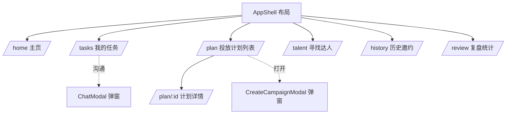
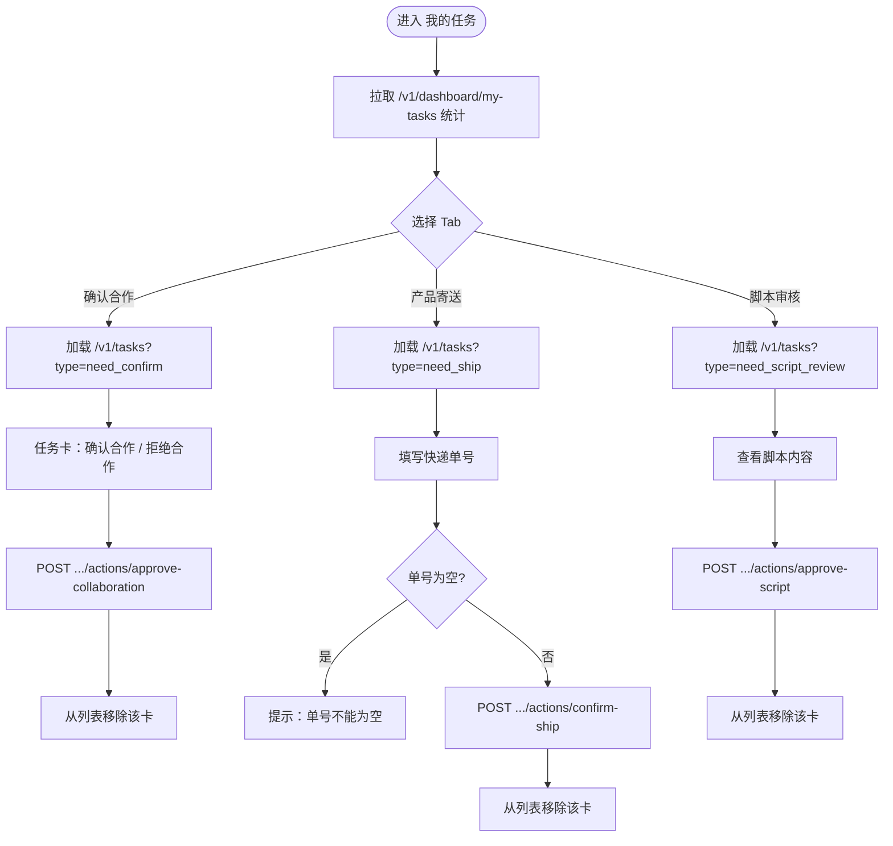
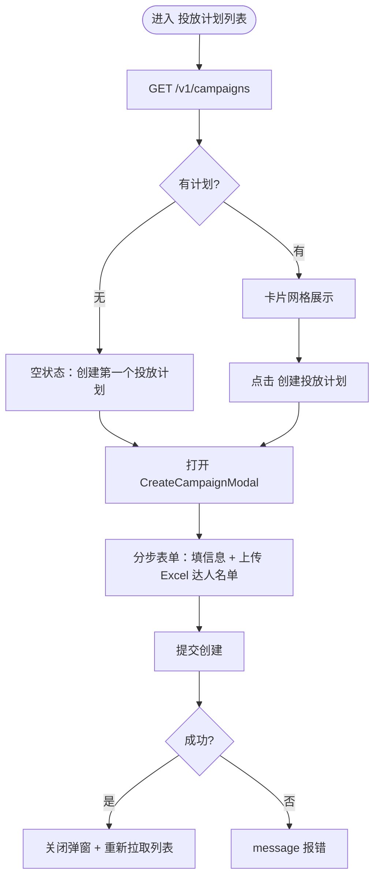
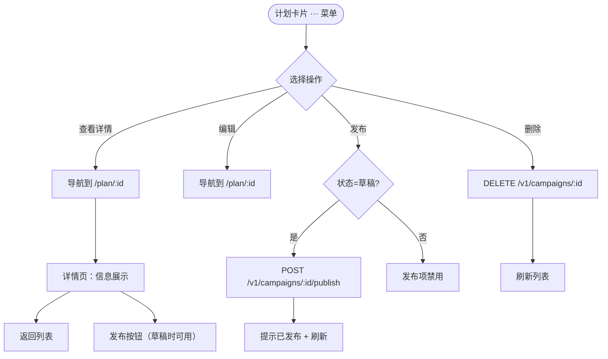

# 聚风前端 · Sitemap & UI Flow

基于当前代码（`src/router.tsx`、`pages/`、`components/`）整理的站点地图与用户交互流程。

---

## 一、Sitemap（站点地图）

所有页面都嵌套在 `AppShell`（侧边栏 + 顶栏）布局下，弹窗（Modal）不占独立路由。

```
聚风后台
│
├── AppShell（持久布局：侧边导航 + 顶栏搜索/通知/头像）
│   │
│   ├── /                → 重定向到 /home
│   ├── /home            主页（概览占位）
│   ├── /tasks           我的任务 ──→ 复用 TaskProgress
│   ├── /plan            投放计划列表
│   │     └── /plan/:id  投放计划详情
│   ├── /talent          寻找达人（测试版）
│   ├── /history         历史邀约
│   ├── /review          复盘统计
│   └── /task-progress   任务进度（直达入口）
│
└── 弹窗（无路由，由页面触发）
    ├── CreateCampaignModal   新建投放计划（PlanPage 触发）
    └── ChatModal             达人沟通会话
```

### 侧边栏导航项

| 导航 | 路由 | 角标 |
|------|------|------|
| 主页 | `/home` | — |
| 我的任务 | `/tasks` | 待办任务数 |
| 投放计划 | `/plan` | — |
| 寻找达人 | `/talent` | 「测试版」标签 |
| 历史邀约 | `/history` | — |
| 复盘统计 | `/review` | — |



---

## 二、UI Flow（核心交互流程）

### 流程 1：任务处理（`/tasks` → TaskProgress）

页面进入即拉取统计；三个统计卡同时也是 Tab 切换器，分别加载对应任务列表。



要点：
- 统计接口 `/v1/dashboard/my-tasks` 进页即加载；`need_ship`、`need_script_review` 列表**首次切到对应 Tab 时才懒加载**。
- 操作成功后前端直接从本地列表移除，无需重新拉取整页。
- 寄送 Tab 有快递单号的非空校验（失焦与提交都会校验）。

### 流程 2：创建投放计划（`/plan` → CreateCampaignModal）



要点：
- Excel 名单用 `xlsx` 在前端解析（`CreateCampaignModal`）。
- 创建成功回调 `onSuccess` → `fetchCampaigns()` 刷新列表。

### 流程 3：投放计划管理（卡片操作 → 详情）



要点：
- 卡片右上角 `···` 下拉：查看详情 / 编辑 / 发布 / 删除。
- 「发布」仅当状态为 `draft` 时可用。
- 详情页 `/plan/:id` 通过路由参数加载单个计划，支持返回与发布。

---

## 三、页面与后端接口对照

| 页面 / 组件 | 主要接口 |
|-------------|----------|
| AppShell | `GET /v1/dashboard/my-tasks`（侧边角标） |
| TaskProgress | `GET /v1/dashboard/my-tasks`、`GET /v1/tasks?type=...`、`POST /v1/tasks/{id}/actions/*` |
| PlanPage | `GET /v1/campaigns`、`POST /v1/campaigns/{id}/publish`、`DELETE /v1/campaigns/{id}` |
| CreateCampaignModal | `POST /v1/campaigns`（+ Excel 本地解析） |
| CampaignDetailPage | `GET /v1/campaigns/{id}`、`POST /v1/campaigns/{id}/publish` |
| HomePage / TalentPage / HistoryPage / ReviewPage | 占位 / 测试版，暂无核心接口 |

> 说明：`/talent`（寻找达人）标注为「测试版」，`/home`、`/history`、`/review` 当前为占位页面。
